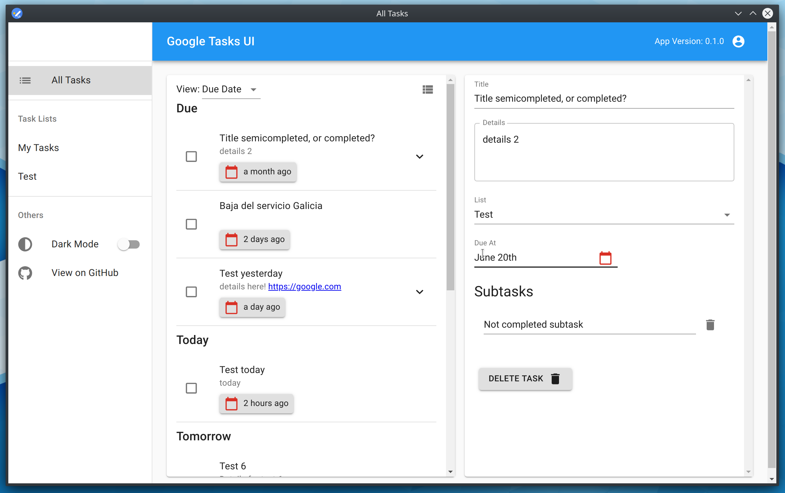
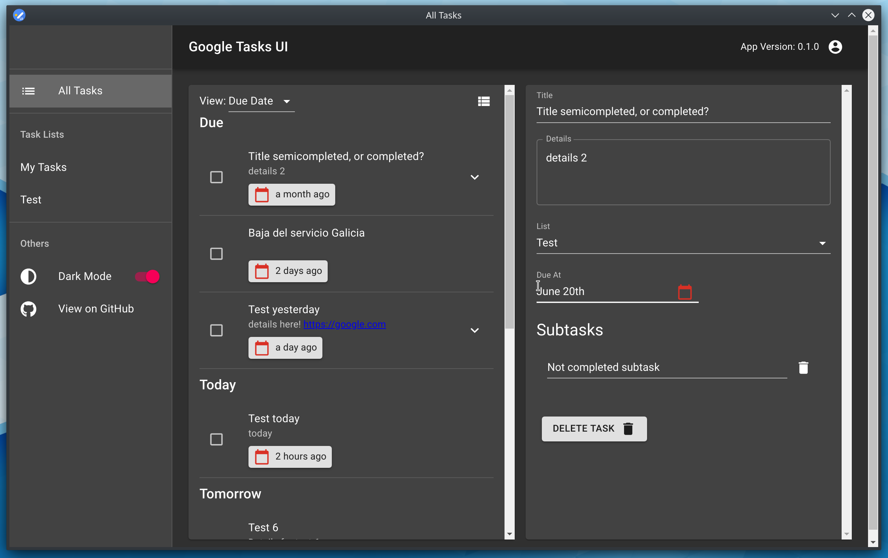
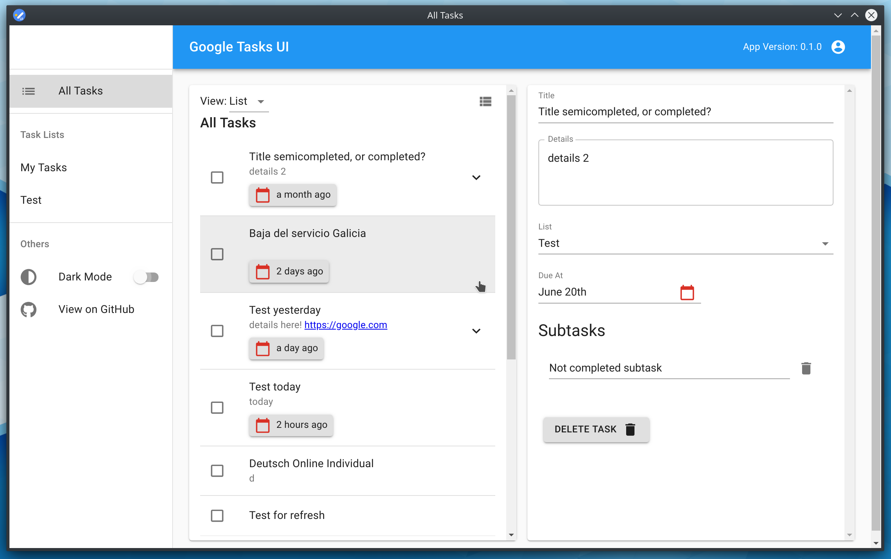
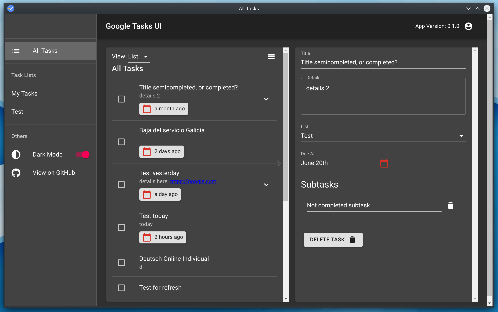
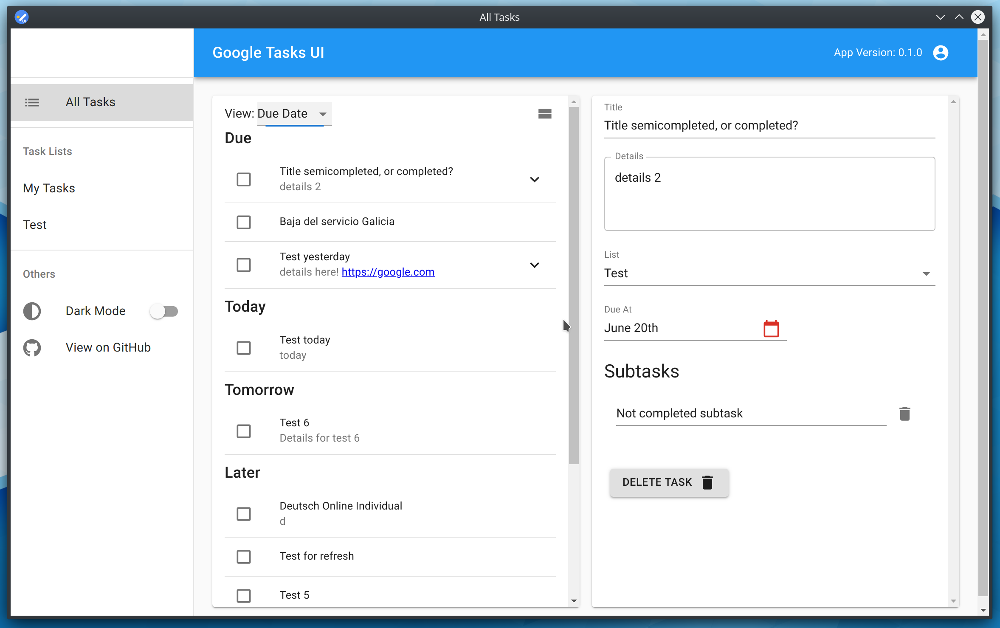

# [GTasks UI](https://gtasksui.net)  (Unofficial) &middot;   

Open source UI that connects to your Google Tasks account and it's intended to be an additional interface for the service for desktop applications, and to bring a full web experience over Google Tasks. It's not intended to replace existing Google Tasks solutions but to complement them.

This app is not affiliated, sponsored or developed by Google by any means, it's a hobby project that some people seem to be liking and using. I do not plan on charging, nor collecting metrics or any type of data from the use of this app.
This app connects to the Google Tasks API which privacy policies can be found here [Google API Privacy Policy](https://developers.google.com/terms/api-services-user-data-policy).
Our servers only host the front-end application and you browser does not send any of your private information to our servers, all communications are done directly from the browser to the Google APIs.

[View it in action](https://gtasksui.net)

## Features

* Web UI for Google Tasks
* All tasks view
* Multiple view modes
  * Due date group / List
  * Dense / Comfort
* Support for subtasks
* Auto save
* Dark mode support
* ... More coming soon!

## Gallery
| Light Mode | Dark Mode |
------|------
 | 
 | 
 | 

This application is undergoing heavy development and any contributions are welcomed!

## Contributions

Please feel free to ask for new features by creating issues, or to work on features by creating pull requests.
I'm currently working hard to make this app amazing, it's already in working conditions and improving all the time.

If you find any errors or strange behaviors, please report them by creating an issue.

### Web interface 
  
`npm run start`

Runs the app in the development mode. 
Open [http://localhost:3000](http://localhost:3000) to view it in the browser.

The page will reload if you make edits. 
You will also see any lint errors in the c`onsole.

### Run Tests 

`npm test`

Launches the test runner in the interactive watch mode. 
See the section about [running tests](https://facebook.github.io/create-react-app/docs/running-tests) for more information.

To learn React, check out the [React documentation](https://reactjs.org/).
